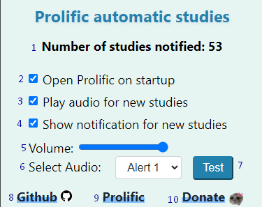

# Prolific Studies Notifier

Welcome Prolific Studies Notifier! 

Get notified when new studies are available on [Prolific](https://app.prolific.com/).
Extension works by notifying when Prolific tab title changes, so [Prolific](https://app.prolific.com/) tab must be opened for the extension to work.

If you like the extension, please give it a star on GitHub! 

## Support Our Efforts

Donations help me make tools like this for free in my spare time. Any amount helps! ❤️

## Enabling Notifications

For notifications to work, you must enable them on your browser AND on your system.

## How to use the extension:

1. Number of studies this extension has notified you.
2. Open Prolific when opening browser.
3. Option to play audio sound chosen below when new study is available.
4. Option to show a notification when new study is available.
5. Select audio volume.
6. Select audio sound from a list.
7. Test sound and notification.
8. [GitHub page for extension](https://github.com/spin311/ProlificAutomaticStudies)
9. Open Prolific website.
10. [Donate with PayPal or any credit card](https://www.paypal.com/donate/?hosted_button_id=4WXEWMN3QGLGY)

Make sure to pin the extension.

## Contact

If you have any suggestions or questions, you can contact me at [spin311pro@gmail.com](mailto:spin311pro@gmail.com)

Enjoy 😊